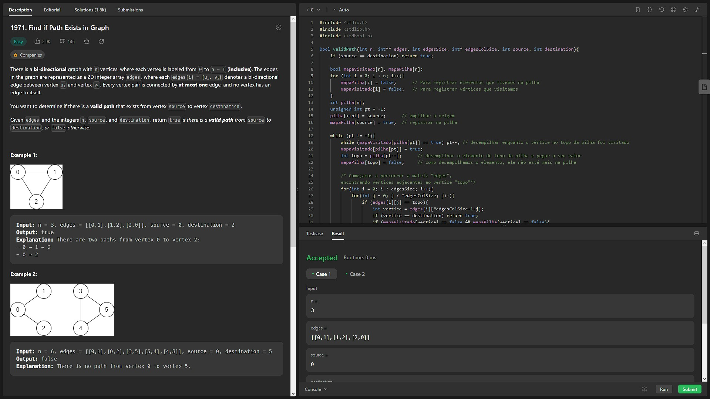
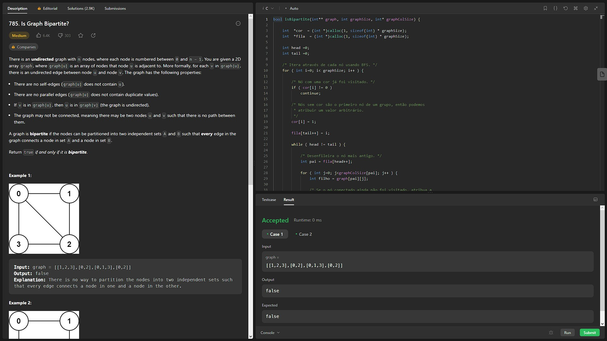
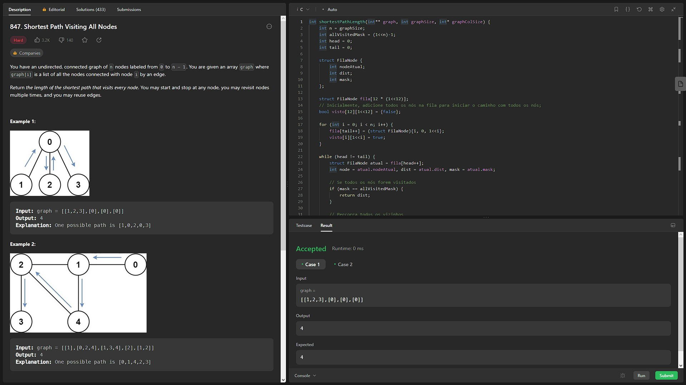

# Exercícios Grafos 1

**Conteúdo da Disciplina**: Grafos 1 

## Alunos
|Matrícula | Aluno |
| -- | -- |
| 19/0036940  | Rafael Fernandes Amancio |

## Sobre 
&emsp;&emsp; Foram realizados três exercícios sobre Grafos que possuem três dificuldades diferentes (Fácil, Médio e Difícil), propostos pelo site [leetcode.com](https://leetcode.com).

## Screenshots
[Exercício 1](https://leetcode.com/problems/find-if-path-exists-in-graph/) (Fácil). Clique [aqui](/Exercicio_1/exercicio_1.c) para ver o código.    

[Exercício 2](https://leetcode.com/problems/is-graph-bipartite/) (Médio). Clique [aqui](/Exercicio_1/exercicio_2.c) para ver o código. 

[Exercício 3](https://leetcode.com/problems/shortest-path-visiting-all-nodes/description/) (Difícil). Clique [aqui](/Exercicio_1/exercicio_3.c) para ver o código. 

## Instalação 
**Linguagem**: C 
